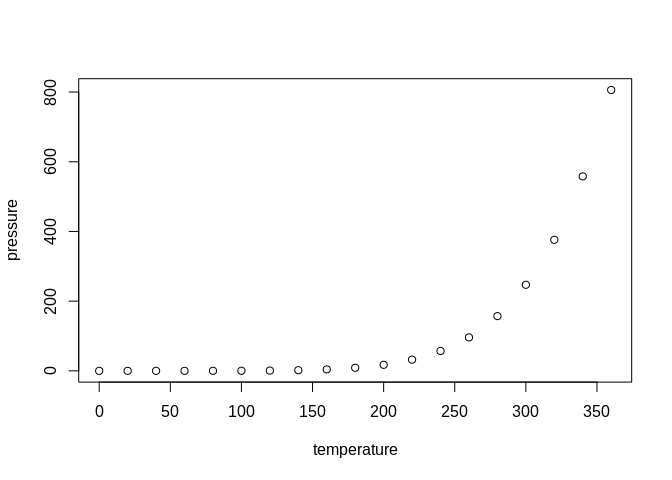

<!-- README.md is generated from README.Rmd. Please edit that file -->

# helpeRs

<!-- badges: start -->

[](https://github.com/drejom/helpeRs/actions)
[](https://app.codecov.io/gh/drejom/helpeRs?branch=main)
[](https://www.repostatus.org/#concept)
[](https://choosealicense.com/licenses/mit/)
[](/commits/main)
[](https://cran.r-project.org/)
[,%20Bird%20Hippie-orange.svg?style=flat-square)](commits/main)

<!-- badges: end -->

The goal of helpeRs is to …

## Things to include

<https://www.r-bloggers.com/2016/07/introducing-badgecreatr-a-package-that-places-badges-in-your-readme/>

<https://www.r-bloggers.com/2017/06/how-to-add-code-coverage-codecov-to-your-r-package/>

<https://cynkra.github.io/fledge/>

## Installation

You can install the development version of helpeRs from
[GitHub](https://github.com/) with:

``` r
# install.packages("devtools")
devtools::install_github("drejom/helpeRs")
```

## Example

This is a basic example which shows you how to solve a common problem:

``` r
library(helpeRs)
## basic example code
```

What is special about using `README.Rmd` instead of just `README.md`?
You can include R chunks like so:

``` r
summary(cars)
#>      speed           dist       
#>  Min.   : 4.0   Min.   :  2.00  
#>  1st Qu.:12.0   1st Qu.: 26.00  
#>  Median :15.0   Median : 36.00  
#>  Mean   :15.4   Mean   : 42.98  
#>  3rd Qu.:19.0   3rd Qu.: 56.00  
#>  Max.   :25.0   Max.   :120.00
```

You’ll still need to render `README.Rmd` regularly, to keep `README.md`
up-to-date. `devtools::build_readme()` is handy for this. You could also
use GitHub Actions to re-render `README.Rmd` every time you push. An
example workflow can be found here:
<https://github.com/r-lib/actions/tree/v1/examples>.

You can also embed plots, for example:



In that case, don’t forget to commit and push the resulting figure
files, so they display on GitHub and CRAN.
